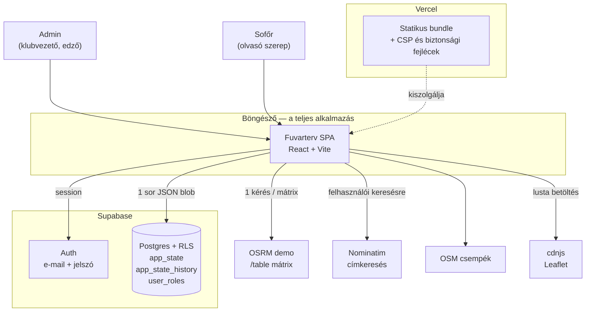
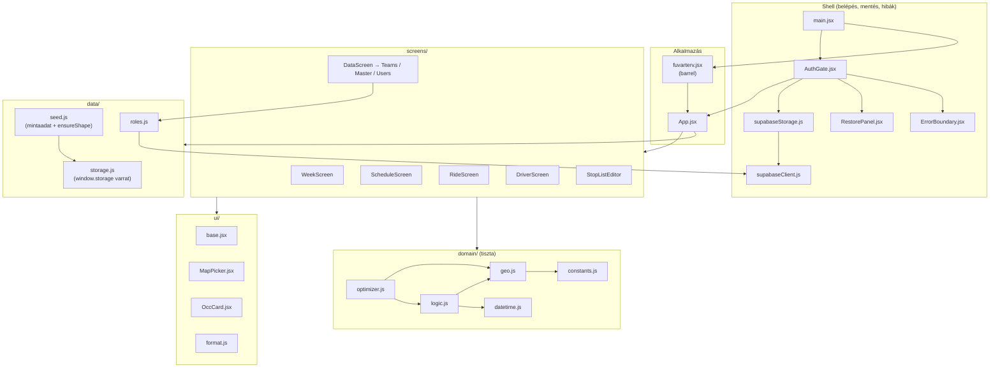
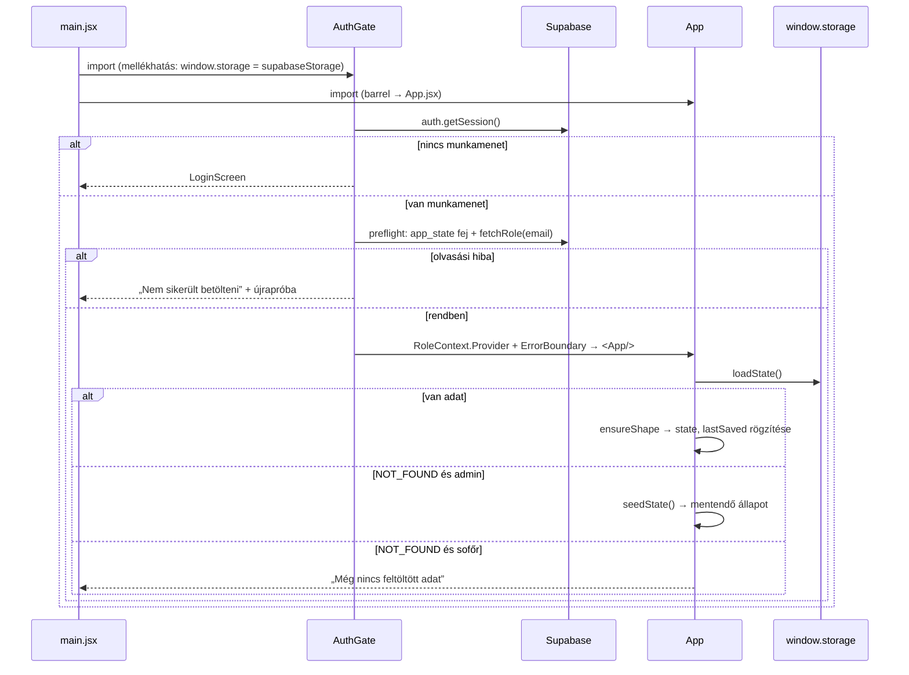
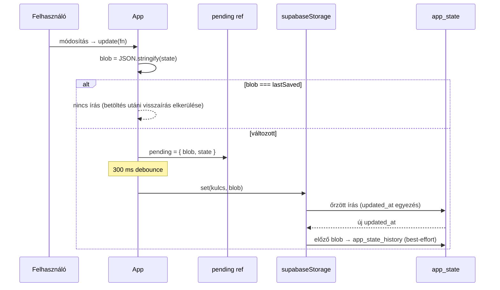
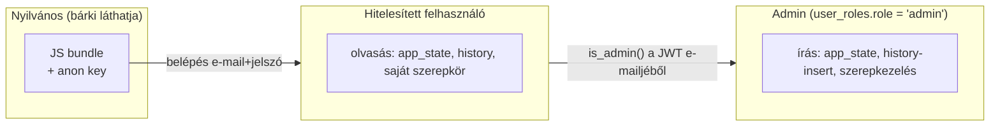
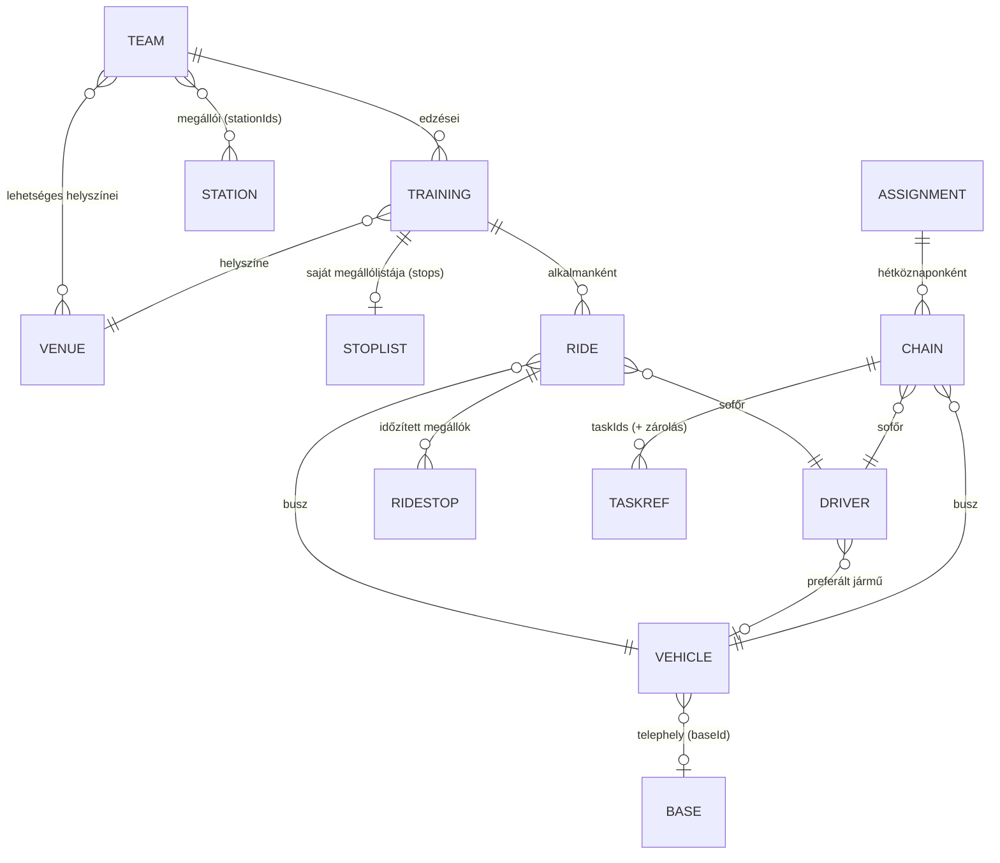
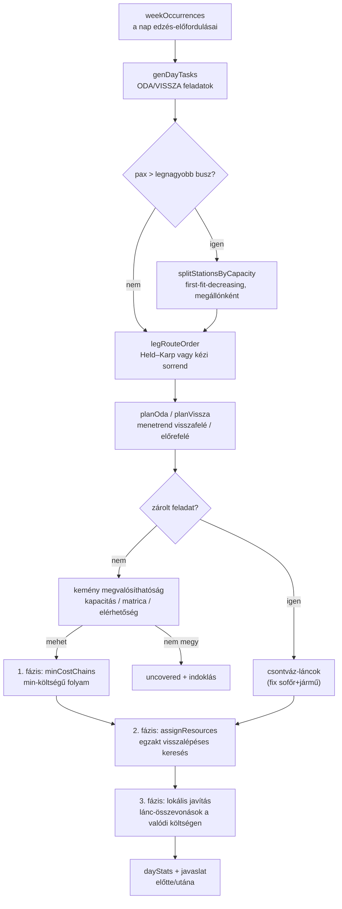

# Fuvarterv — architektúra és tervezési döntések

Ez a dokumentum azt írja le, **hogyan van felépítve** a Fuvarterv, és főleg azt, hogy
**miért így**. A célja, hogy a kódbázis évek múlva is karbantartható maradjon: aki
módosít benne, lássa, mely szabályok tartják egyben a rendszert, és melyik változtatás
mit dönt romba.

Három dokumentum tartozik össze:

| Dokumentum | Mire válaszol |
|---|---|
| [`DEVELOPER.md`](DEVELOPER.md) | **Hogyan működik?** — fájlról fájlra, mezőről mezőre haladó referencia (angolul). |
| **`ARCHITECTURE.md`** (ez) | **Miért így van felépítve?** — rétegek, invariánsok, adatáramlás, kockázatok. |
| [`DECISIONS.md`](DECISIONS.md) | **Ki döntötte el, és mi lett volna a másik út?** — tömör döntésnapló (ADR). |
| [`MAINTENANCE.md`](MAINTENANCE.md) | **Mit csináljak, ha hozzányúlok?** — munkafolyamat, konvenciók, ellenőrzőlisták. |

> **Nyelv.** A felület, a kódkommentek és ez a dokumentáció magyar; az azonosítók
> angolosak. A magyar↔angol szószedet a [`DEVELOPER.md` 20. fejezetében](DEVELOPER.md#20-glossary-hungarian--english) van.

---

## Tartalom

1. [Mit old meg a rendszer](#1-mit-old-meg-a-rendszer)
2. [Rendszerkontextus](#2-rendszerkontextus)
3. [Vezérlő tervezési elvek](#3-vezérlő-tervezési-elvek)
4. [Rétegek és modultérkép](#4-rétegek-és-modultérkép)
5. [Futásidejű architektúra](#5-futásidejű-architektúra)
6. [Állapotkezelés és a mentési ciklus](#6-állapotkezelés-és-a-mentési-ciklus)
7. [Perzisztencia és konkurencia](#7-perzisztencia-és-konkurencia)
8. [Biztonsági architektúra](#8-biztonsági-architektúra)
9. [Domain modell és invariánsok](#9-domain-modell-és-invariánsok)
10. [Az ütemező pipeline](#10-az-ütemező-pipeline)
11. [Külső szolgáltatások és degradáció](#11-külső-szolgáltatások-és-degradáció)
12. [Felületi architektúra](#12-felületi-architektúra)
13. [Teljesítmény és skálázási határok](#13-teljesítmény-és-skálázási-határok)
14. [Tesztarchitektúra](#14-tesztarchitektúra)
15. [Bővítési forgatókönyvek](#15-bővítési-forgatókönyvek)
16. [Ismert kockázatok és technikai adósság](#16-ismert-kockázatok-és-technikai-adósság)

---

## 1. Mit old meg a rendszer

Egy vidéki kézilabdaklub több utánpótláscsapatot hord kisbuszokkal edzésre a környező
falvakból. A feladat nem egyetlen útvonal megtervezése, hanem egy **napi erőforrás-
ütemezés**: adott edzésidőpontok, megállók, létszámok, buszok és sofőrök mellett ki
melyik fuvart viszi, melyik busszal, és hogyan fűzhetők egymás után a fuvarok, hogy a
napi bérköltség a lehető legkisebb legyen.

Ebből három dolog következik, ami az egész architektúrát meghatározza:

1. **Az adatmennyiség kicsi, a logika nehéz.** Néhány tucat entitás, viszont NP-nehéz
   ütemezési mag. Ezért nincs backend, nincs adatbázis-séma és nincs lekérdezésnyelv:
   az egész állapot egyetlen JSON blob, a számítás pedig a böngészőben fut.
2. **A felhasználók nem informatikusok.** Klubvezetők és sofőrök. Ezért minden
   hibaágnak **kimondható** üzenete van, és minden „nem sikerült” esethez tartozik
   indoklás — a néma kihagyás tiltott (lásd [3. elv](#3-vezérlő-tervezési-elvek)).
3. **Egyszerre gyakorlatilag egy ember szerkeszt.** Ezért nem valós idejű
   együttműködés van, hanem **egyszerkesztős modell optimista ütközésvédelemmel**:
   olcsó, kiszámítható, és nem veszít adatot.

---

## 2. Rendszerkontextus



**A rendszer határa a böngésző.** Nincs saját szerverkód: az üzleti logika, az
optimalizálás és a validáció mind kliensoldali. Amit ez a döntés megkövetel, az a
[8. fejezet](#8-biztonsági-architektúra): ha a kliens megkerülhető, akkor a
tényleges védelmet az adatbázis szabályainak (RLS) kell adniuk, nem a felületnek.

---

## 3. Vezérlő tervezési elvek

Ez a nyolc elv az, amit egy módosítás **nem ronthat el**. Mindegyiknél ott van, hol
él a kódban, és mi történik, ha megsérül.

### E1. Egy állapot, egy blob

A teljes munkaterület egyetlen sima objektum (`teams`, `stations`, `venues`, `bases`,
`vehicles`, `drivers`, `trainings`, `rides`, `assignments`, `matrix`, `settings`),
amely egyetlen adatbázissorban, JSON-ként él.

*Miért:* atomi mentés, triviális visszaállítás, nincs séma-migráció szerveroldalon,
és az összes származtatott nézet egyetlen konzisztens pillanatképből számolható.
*Ára:* nincs részleges mentés és nincs valós idejű együttszerkesztés.
*Hol:* `src/data/storage.js`, `src/supabaseStorage.js`.

### E2. A domain tiszta, a mellékhatás a peremen van

A `src/domain/` és `src/data/seed.js` függvényei bemenetből kimenetet számolnak;
nem olvasnak `window`-ot, nem hívnak hálózatot, nem módosítanak állapotot. Két
kivétel szándékos és jelölt: `computeMatrix` (hálózat) és a `window.storage` varrat.

*Miért:* ettől tesztelhető a rendszer nehéz része böngésző nélkül, és ezért lehet az
optimalizálót property-tesztekkel véletlen állapotokon futtatni.
*Ha megsérül:* a `test/optimizer.test.js` és `test/base-shift.test.js` típusú tesztek
nem írhatók újra — a legdrágább képességet veszítenénk el.

### E3. A függés egyirányú

`screens → ui → domain → data`, visszafelé soha. A `domain/geo.js` szándékosan
levélmodul: `logic` és `optimizer` is használja a `legMin`-t, így ha bármelyikükben
lakna, a kettő körkörös lenne.

*Hol:* a modulok import-listái; a szabály megsértését ma nem gép ellenőrzi, hanem a
kódolvasás — ezért van külön nevesítve.

### E4. Fail-closed biztonság

Aki nincs felvéve adminnak, az sofőr; a sofőr nem ír. A tiltást nem a felület adja,
hanem az RLS. A felület elrejtése kizárólag UX.

*Hol:* `supabase/migrations/0004_user_roles.sql`, `src/AuthGate.jsx` (`fetchRole`),
`src/App.jsx` (`isAdmin` őrök a mentésben is: „öv és nadrágtartó”).

### E5. Degradáció, nem összeomlás

Minden külső függésnek van visszaesési útja, és a visszaesés **látható**:
OSRM → légvonalas becslés (a mátrix `source` mezője jelzi), Leaflet/csempe →
beépített offline SVG-választó, koordináta nélküli pont → `fallbackLegMin`,
képernyőhiba → `ErrorBoundary` a shellen belül (a mentések és a kijelentkezés
elérhető marad).

### E6. „Nincs megadva” ≠ „nulla”

A megállónkénti létszámnál az üres mező azt jelenti, *még nem tudjuk*, a beírt `0`
azt, *ide most nem kell menni*. A kettőt az adat is megkülönbözteti (`""` vs. `0`),
és a `genDayTasks` `zeroed()` predikátuma ezen áll. A `legPax` ezért a bontás és az
összlétszám **maximumát** adja: egy félig kitöltött bontás nem rövidítheti le a
csapatot.

*Ha megsérül:* gyerekek maradnak a megállóban — ez a rendszer legdrágább hibafajtája.

### E7. Néma kihagyás tilos

Ha egy feladat nem készül el vagy nem fedhető le, a rendszer **megmondja, miért**:
`genDayTasks().skipped`, `optimizeDay().uncovered[].reasons`, `resolveDay()` lánc-
`issues`, `contentionReasons`, valamint az elavult láncokra a `droppedChains` üzenet.
Új korlát bevezetésekor az indoklás nem opcionális, hanem a feature része.

### E8. A régi adat viselkedése nem változhat magától

Új mező bevezetésekor az `ensureShape` alapértéke pontosan a korábbi viselkedést adja
(`returnStationIds: null` = tükrözés, `training.stops: null` = a csapat listája,
`baseId: null` = a klub telephelye, annak hiányában a feladatok szerinti számítás).

*Hol:* `src/data/seed.js` — `ensureShape` az egyetlen séma-migrációs pont.

---

## 4. Rétegek és modultérkép



### Rétegszabályok

| Réteg | Szabad | Tilos |
|---|---|---|
| `data/` | alapértékek, alaknormalizálás, a KV varrat | domain-logika, React |
| `domain/` | tiszta számítás, `state` olvasása | React, `window`, hálózat (kivéve `computeMatrix`) |
| `ui/` | általános építőkockák, formázás | domain-szabályok kódolása |
| `screens/` | felület + `state`/`update` propok | közvetlen perzisztencia, Supabase-hívás (kivéve `roles.js` a Felhasználók fülön) |
| shell | belépés, mentés, hibahatár | domain-ismeret |

### Két szándékos „szabálytalanság”

- **`fuvarterv.jsx` barrel.** Az app egyetlen artifact-fájlból nőtt ki. A fájl ma már
  csak újraexportál (`export { default } from "./src/App.jsx"` + a tesztek által
  használt tiszta függvények). Azért maradt, mert a `src/main.jsx` és a **teljes
  tesztkészlet innen importál**: a szétvágás így egyetlen importot sem tört el, és a
  tesztek a modulhatárok mozgatásától függetlenek maradtak. Új kód **soha** nem ide
  kerül — csak az export sora, ha a tesztnek kell.
- **`data/roles.js` közvetlenül a Supabase-t hívja.** A `window.storage` varrat
  szándékosan csak a munkaterület-blobra vonatkozik; a szerepkörök nem részei az
  app-állapotnak (más tábla, más jogosultság, más életciklus).

---

## 5. Futásidejű architektúra

### 5.1 A shell és az app szétválasztása

Két, egymást nem ismerő rész van:

- **Shell** (`AuthGate` és barátai): belépés, munkamenet, szerepkör, a perzisztencia
  telepítése, blokkoló hibaállapotok, korábbi mentések, hibahatár.
- **App** (`App.jsx` + `screens/`): az üzleti felület, ami feltételezi, hogy van
  bejelentkezett felhasználó és működő `window.storage`.

A kettő **eseményekkel** kommunikál, nem importtal:

| Esemény | Ki küldi | Ki kezeli | Miért |
|---|---|---|---|
| `fuvarterv:stale` | `supabaseStorage` | `AuthGate` → blokkoló overlay | a tároló nem ismerheti a React-fát |
| `fuvarterv:saveerror` | `supabaseStorage` | `AuthGate` → toast | ugyanaz |
| `fuvarterv:restore` | `App` fejléc, `ErrorBoundary` | `AuthGate` → `RestorePanel` | az app nem importálhat auth-ot |
| `fuvarterv:signout` | `App` fejléc, üres munkaterület képernyő | `AuthGate` → `signOut` + `storage.reset()` | ugyanaz |

*Miért így:* az `App` az artifact-örökség miatt nem függhet az auth-rétegtől, és a
`supabaseStorage` egy modul-szintű objektum, nem komponens. A `CustomEvent` a
legkisebb varrat, ami ezt megoldja; cserébe a kapcsolat nem típusos, ezért a négy
eseménynév ezen a táblán van dokumentálva.

### 5.2 Indulási sorrend



Két részlet, ami tudatos:

- **A `window.storage` import-időben áll be**, mielőtt az `App` mountolna. Az `App`
  csak létező munkamenettel renderelődik, így hitelesítetlen kérés sosem megy át rajta.
- **A preflight olvasás** azért van, hogy egy pillanatnyi olvasási hiba ne legyen
  összetéveszthető az üres munkaterülettel — különben az app mintaadatot vetne a
  fel nem olvasott valós adat fölé. Ugyanezt a különbségtételt szolgálja a tipizált
  `NOT_FOUND` hiba (`isNotFound`) és a `test/load-error.test.js`.
- **A preflight a felhasználó azonosítójára fut, nem a session-objektumra**: a
  `TOKEN_REFRESHED` esemény óránként új objektumot ad, és arra kötve az `App`
  újramountolna — elvesztve minden nyitott űrlapot.

---

## 6. Állapotkezelés és a mentési ciklus

Egyetlen `useState` tartja a teljes állapotot az `App`-ban, és minden módosítás
`update(fn)` alakú, immutábilis frissítés. **Nincs Redux, nincs context-store.**

*Miért:* a képernyők úgyis a teljes állapotot olvassák (a beosztás és az ütközések
keresztbe hivatkoznak mindenre), a mentés pedig blob-alapú — egy globális store itt
absztrakciót adna hozzá, képességet nem. A skálázási ára ismert és vállalt: minden
módosítás újrarendereli a fát ([13. fejezet](#13-teljesítmény-és-skálázási-határok)).

### A mentési ciklus



Négy dolog, amit könnyű elrontani, ezért itt van kimondva:

1. **A mentés a blob tartalmához hasonlít, nem az objektumidentitáshoz.** Enélkül
   minden oldalbetöltés visszaírná a beolvasott állapotot: a másik szerkesztőt
   ütközésbe kergetné, és elégetné a 20 elemű mentési előzményt.
2. **A függőben lévő mentést ki kell üríteni** lapelrejtéskor (`visibilitychange`),
   lapbezáráskor (`pagehide`) és unmountkor (`flush()`). A kijelentkezés unmount:
   nélküle a debounce némán eldobná az utolsó módosítást.
3. **Sofőr sosem ír** — sem a `flush`, sem a mentő effekt nem ütemez neki. Ez nem
   biztonsági intézkedés (azt az RLS adja), hanem a hibaüzenet elkerülése.
4. **A `seedState()` mintaadatot mentésre szánjuk**, mert az hozza létre a sort;
   a szerverről olvasott állapot viszont már perzisztált, ezért `lastSaved`-be kerül.

---

## 7. Perzisztencia és konkurencia

### 7.1 A `window.storage` szerződés

```js
get(key)    // → { key, value } | dob { code: "NOT_FOUND" }
set(key, v) // v: már JSON-stringgé alakított állapot
delete(key)
list(prefix)
reset()     // kijelentkezéskor: modul-szintű gyorsítótár ürítése
```

Ez az artifact-környezet KV API-ja. Azért maradt meg, mert **egyetlen, szűk varratra
szűkíti a perzisztenciát**: a Supabase-implementáció (`supabaseStorage.js`) cserélhető
bármi másra (fájl, IndexedDB, saját backend) anélkül, hogy az app-kód változna. A
tesztek is ezen a varraton keresztül adnak hamis tárolót.

### 7.2 Egyszerkesztős modell optimista őrrel

A tárolóréteg megjegyzi a legutóbb olvasott `updated_at`-et, és csak akkor ír felül,
ha az még mindig ugyanaz (`.eq("updated_at", prev)`). Ha nem — valaki más mentett —,
az írás **nem** megy át, a felhasználó blokkoló overlayt kap, és csak újratöltéssel
folytathatja.

*Miért nem merge:* két párhuzamos szerkesztő összefésülése blob-szinten
megoldhatatlan, elemenként pedig egy olyan konfliktuskezelő felületet igényelne,
amit ez a felhasználói kör nem tudna használni. A klubban egyszerre egy ember
szerkeszt; a ritka ütközés helyes viselkedése az, hogy **senki adata nem vész el**.

### 7.3 A három nem nyilvánvaló eset

| Eset | Mi történne naivan | Mit csinál a kód |
|---|---|---|
| Egyszerre két mentés (lassú válasz + debounce) | a második elavult `lastSeen`-nel indulna, és hamis ütközést jelentene | `writeChain`: az írások sorosítva futnak, és a lánc sosem marad elutasított állapotban |
| **Elveszett válasz** (az írás bement, a válasz nem jött meg) | 0 sor illeszkedik → „valaki más mentett” → a munkaterület indokolatlanul blokkolódik | `lastAttempt` + visszaolvasás: ha a szerveren pont az áll, amit írni akartunk, az a *mi* írásunk volt — átvesszük az időbélyeget és újrapróbáljuk |
| Első mentés két klienstől | egyedi kulcs ütközés (23505) általános mentési hibaként | ütközésként kezeljük (`announceStale`), nem hibaként — a másik kliens adatát nem írjuk felül |

A `jsonb` a körbefordulás során átrendezi a kulcssorrendet, ezért az összehasonlítás
`stableStr()`-rel megy (rekurzívan rendezett kulcsok), nem nyers `JSON.stringify`-jal.

### 7.4 Előzmény (visszaállítás)

Minden sikeres felülíráskor az **előző** blob bekerül az `app_state_history` táblába,
és a kliens 20 pillanatképre nyes. Szándékosan **best-effort**: minden hibát elnyel,
mert az előzmény írása sosem buktathat el egy mentést. Ennek az ára, hogy a hiányzó
tábla (le nem futott `0002` migráció) csendben „nincs mentés” állapotnak látszik —
ezért a `RestorePanel` külön felismeri a `42P01` hibát, és megmondja a teendőt.

Azonos blobot nem archiválunk: a 20 hely azonos másolatokkal feltöltve pont azokat a
visszaállítási pontokat semmisítené meg, amikért a felhasználó odanéz.

---

## 8. Biztonsági architektúra



**A bizalmi határ az adatbázis, nem a felület.** A böngészőben futó kód teljes
egészében a felhasználó kezében van; a felület szerep szerinti szűkítése (`isAdmin`
őrök az `App`-ban) kizárólag azért van, hogy a sofőr ne kapjon értelmetlen gombokat
és tiltott írásokat.

| Tábla | select | insert | update | delete |
|---|---|---|---|---|
| `app_state` | bármely hitelesített | admin, csak a munkaterület-kulcsra | admin, csak a munkaterület-kulcsra | **nincs szabály** (tilos) |
| `app_state_history` | bármely hitelesített | admin, csak a munkaterületre | – | hitelesített, csak a munkaterületre (nyesés) |
| `user_roles` | saját sor, vagy admin mindet | admin | admin | admin |

Négy döntés, ami ezt a modellt tartja:

1. **A szerepkör e-mail alapú, nem user-id alapú.** Így az admin az appból oszthat
   szerepet olyan címnek is, amely még nem lépett be; az e-mailt a Supabase auth
   hitelesíti, és a JWT-ből olvassa vissza az `is_admin()`.
2. **Nincs sor = sofőr** (fail-closed). Egy elfelejtett fiók megnézheti a
   beosztást, de nem nyúlhat semmihez.
3. **Egy szándékos kivétel:** ha maga a `user_roles` tábla hiányzik (a `0004`
   migráció nem futott le), a kliens mindenkit adminnak vesz. Ilyenkor a szerver sem
   korlátoz semmit, tehát a fülek elrejtése színház volna — viszont e nélkül egy
   frissen deployolt kliens olvasásra némítaná a régi adatbázis minden felhasználóját.
4. **A publikus regisztráció kikapcsolása a biztonsági modell fele.** Minden szabály
   „hitelesített felhasználót” enged, az anon kulcs pedig a bundle-ben utazik. Nyitott
   regisztráció mellett bárki, aki kiolvassa a kulcsot, olvashatja az adatot.

A `vercel.json` CSP-je pontosan a ténylegesen használt origókat engedi, és
**`'unsafe-inline'` nélkül** működik (a production `index.html`-ben nincs inline
script vagy stílus; a React és a Leaflet CSSOM-on át állít stílust, amit a CSP nem
szabályoz). Új külső szolgáltatáshoz kötelező a hozzá tartozó direktíva, különben a
böngésző némán blokkol.

---

## 9. Domain modell és invariánsok

### 9.1 Entitások



A mezőszintű alakot a [`DEVELOPER.md` 7. fejezete](DEVELOPER.md#7-the-data-model-the-single-json-blob)
írja le. Itt az számít, ami a **kapcsolatokból** következik.

### 9.2 Tárolt, származtatott és hibrid adat

| Fajta | Példa | Hol keletkezik | Élettartam |
|---|---|---|---|
| Tárolt | csapat, állomás, jármű, sofőr, edzés, fuvar, beosztás | felhasználói szerkesztés | a blobban |
| Származtatott | előfordulás (`weekOccurrences`), feladat (`genDayTasks`), lánc nézetmodell (`mkChain`, `resolveDay`) | minden rendereléskor újraszámolva | memória |
| Hibrid | `matrix` (számított, de eltárolt), `assignments` (a láncok *hivatkoznak* származtatott feladatokra) | számítás + mentés | a blobban |

A hibrid adat a rendszer legérzékenyebb pontja, mert **eltárolt hivatkozás mutat
újraszámolt objektumra**:

- A **feladatazonosító** `${trainingId}:${nap|"x"}:${irány}${#index}` alakú, tehát a
  megállók vagy létszámok módosítása után egy `…:vissza` azonosítóból `…:vissza#1`
  lehet. A `resolveDay` az elavult láncokat nem dobja el némán: megszámolja
  (`droppedChains`), és a felület kiírja, hogy futtasd újra az optimalizálást.
- A **mátrix** kulcsa (`matrixKey`) az összes koordinátás pont id-jét és 5 tizedesre
  kerekített koordinátáját tartalmazza; ha eltér az aktuálistól, a felület jelzi, hogy
  a mátrix elavult.

### 9.3 A rendszer invariánsai

Ezek a tesztekkel is rögzített szabályok. Ha egy módosítás bármelyiket megsérti,
az hibajavítás helyett hibabevezetés.

| # | Invariáns | Hol él | Teszt |
|---|---|---|---|
| I1 | Felülírás nélkül a visszaút az odaút tükre — meglévő csapatnál semmi nem változik | `legFor`, `teamLeg` | `return-leg.test.js` |
| I2 | Az edzés saját megállólistája **teljes** felülírás; irányonkénti félig-öröklés nincs | `legSource` | `training-leg.test.js` |
| I3 | A szállítandó létszám a bontás és az összlétszám maximuma | `legPax` | `fixes.test.js` |
| I4 | Explicit 0 fős megálló kimarad az útvonalból; üres mező nem | `genDayTasks.zeroed` | `zero-count-stops.test.js` |
| I5 | Minden feladat pontosan egy láncba kerül, vagy fedetlenként indoklást kap | `minCostChains` (`seen`), `optimizeDay` | `optimizer.test.js` |
| I6 | Egy jármű/sofőr két lánca között fizikailag át kell érni | `resourceClash`, `resolveDay` | `optimizer.test.js` |
| I7 | A kiszállási díj műszakonként jár, nem lánconként | `driverPay` + `mergeShifts` | `base-shift.test.js` |
| I8 | Matricás helyszínre csak matricás jármű kerülhet (az optimalizálásban kemény korlát) | `assignResources`, `optimizeDay` | `vignette.test.js` |
| I9 | Állomás/helyszín/telephely koordináta nélkül nem menthető | `MasterForm` | `master-coord.test.jsx` |
| I10 | Hivatkozott törzsadat nem törölhető | `deleteGuard` (+ `chainRefs`) | `fixes.test.js` |
| I11 | Valós adat fölé sosem kerül mintaadat olvasási hiba után | `isNotFound`, preflight | `load-error.test.js` |
| I12 | Mentett fuvar iránya nem állítható át | `RideForm` | `ride-direction.test.jsx` |

---

## 10. Az ütemező pipeline

Ez a rendszer szíve, és az egyetlen hely, ahol az „egyszerű megoldás” nem elég.

### 10.1 A feladat

Adott egy nap edzés-előfordulásainak halmaza. Mindegyikből keletkezik egy **ODA** és
egy **VISSZA** feladat (ha kell, kapacitás miatt buszonként több is). Egy sofőr+jármű
pár több feladatot is elvihet egymás után, ha időben és térben átér köztük. A cél a
napi **bérköltség** minimalizálása:

```
költség = Σ műszakonként [ kiszállási díj + max(műszakhossz, minimum műszak) / 60 × órabér ]
műszak  = a telephelytől telephelyig tartó, egymásba érő sávok uniója
```

Ez lényegében egy erőforrás-korlátos ütemezés — NP-nehéz. Egyetlen egzakt modell
(pl. MILP) nem futna böngészőben, ezért a megoldás **három fázisú**, és a fázisok
egyre pontosabb költségfüggvényen dolgoznak.

### 10.2 A pipeline



### 10.3 Fázisok és miért ilyenek

**0. Feladatgenerálás (`genDayTasks`).** Irányonként külön kör, mert a visszaútnak
saját megállói, saját létszámai és akár saját buszszáma lehet. A két irány feladatai
ezután **függetlenek**: a láncolás időre és üresjáratra megy, az #1/#2 párosítást
semmi nem kényszeríti ki.

**Menetrend.** Az ODA menetrend **visszafelé** számolódik az edzés kezdete előtti
céltidőpontból (mikor kell indulni, hogy időben odaérj), a VISSZA **előrefelé** az
edzés vége utáni indulástól. Ez az egyetlen helyes irány: a fix pont mindkét esetben
a helyszín, nem a megálló.

**Útvonalsorrend (`bestStationOrder`).** Held–Karp dinamikus programozás, `2^n × n`
állapottal, opcionális rögzített első/utolsó megállóval és a helyszínnel mint elő-
vagy utótaggal. **10 megállóig egzakt**, felette az eredeti sorrend marad — 10 fölött
a memória és az idő is elszaladna, és a valóságban egy kör ennél nem hosszabb.

**1. fázis — láncolás (`minCostChains`).** Páros gráf: minden feladat egyszer lehet
„előd” és egyszer „utód”; él akkor van `A→B` között, ha `A.vég + üresjárat(A.hova,
B.honnan) ≤ B.kezdet`. Élköltség:

```
él(A→B) = (kényszerített várakozás ? 0 : rés × átlagos percbér) − kiszállási díj
```

A negatív tag a lényeg: a láncolás **egy kiszállási díjat spórol**, a rés viszont
fizetett időbe kerül — hacsak a sofőr a rés alatt úgysem tudna hazamenni (akkor a
várakozás láncolás nélkül is fizetett, tehát nem a láncolás terhe). Az algoritmus
egymást követő legrövidebb utakon küld folyamot, és **csak negatív összköltségű
utakon** — így pontosan addig láncol, amíg az olcsóbb. A ciklus `n` javítóútra van
korlátozva; a kiolvasás `seen` halmazzal garantálja, hogy elfajult esetben (kör a
succ/pred gráfban) se tűnhessen el feladat.

**2. fázis — erőforrás-hozzárendelés (`assignResources`).** Visszalépéses keresés a
valódi költségfüggvényen, költségkorlátos vágással (`cost >= best.cost` → vissza).
Egy lánc ára a sofőr napi költségének **növekménye**: ha a lánc egy meglévő
műszakhoz tapad, csak a plusz fizetett idő az ára, második kiszállási díj nélkül.
A keresés `30 000` iteráció után leáll, és ezt **jelzi** (`capped` → „heurisztikus”
megjegyzés) — nem tesz úgy, mintha optimumot talált volna.

**3. fázis — lokális javítás.** Az 1. fázis csak átlagbérrel és résekkel számolt; a
minimum műszak és az eltérő órabérek hatását itt korrigáljuk: szabad láncokat és
csontváz-láncokat próbálunk összevonni, és a próbát csak akkor fogadjuk el, ha a
teljes terv költsége **szigorúan** csökken. Legfeljebb 60 kör.

### 10.4 Kemény és puha korlátok

| Korlát | Fajta | Hol érvényesül |
|---|---|---|
| Férőhely ≥ lánc maximális létszáma | kemény | `assignResources`, `optimizeDay` előszűrő |
| Országos matrica matricás helyszínhez | kemény | `chainNeedsVignette` szűrő az opciókban |
| Sofőr elérhetősége a teljes sávra | kemény | `driverAvailableFor` (az érintkező ablakok összeolvadnak) |
| Erőforrás-ütközés + átérés | kemény | `resourceClash` |
| Zárolt feladat marad a helyén | kemény | csontváz-láncok |
| Preferált jármű | **puha** — `preferredBias` Ft büntetés | `assignResources`, `skelCost` |

> **Aranyszabály a költségfüggvényre.** Ha egy tag (pl. a `preferredBias`) bekerül a
> hozzárendelés költségébe, akkor **ugyanúgy** be kell kerülnie a csontváz-láncok
> árába (`skelCost`) is. Amikor ez elcsúszott, a javítóciklus torzított és torzítatlan
> költséget vetett össze, és az optimalizálás *után* nőtt a kijelzett napi költség.

### 10.5 A fizetett idő modellje

A sofőr akkor lép munkába, amikor **elindul a telephelyről**, és akkor végez, amikor
**visszaért** (`spanOf`). Az egymásba érő sávok egy műszakká olvadnak (`mergeShifts`),
és ebből külön szabály nélkül következik a „hazamehet-e két fuvar között?” kérdés
válasza: ha nincs idő hazaérni és visszajönni, a sávok átfednek, tehát egy műszak van
— benne a fizetett helyszíni várakozással (`onSiteWait`). Telephely nélkül a sáv a
feladatokét fedi, vagyis a telephelyek bevezetése előtti számítás — E8 szerint.

### 10.6 Determinizmus

Az optimalizálás **determinisztikus**: nincs véletlen, a rendezések teljes (tie-break
tartalmazó) komparátorokkal mennek, és a bemenet ugyanaz → a kimenet ugyanaz. Ez tette
lehetővé a property-teszteket egy magvas PRNG-vel generált állapotokon
(`test/optimizer.test.js`). Ne vezess be `Math.random()`-ot ebbe az útba; az `uid()`
az egyetlen kivétel, és az csak *új* láncazonosítót gyárt, nem befolyásol döntést.

---

## 11. Külső szolgáltatások és degradáció

| Szolgáltatás | Mikor hívjuk | Ha nem elérhető | Hol |
|---|---|---|---|
| Supabase Auth | belépés, munkamenet | beszédes, esetenkénti hibaüzenet (`loginErrorMessage`) | `AuthGate.jsx` |
| Supabase Postgres | betöltés, mentés, előzmény, szerepkörök | újratöltő képernyő / mentés-toast / blokkoló overlay | `supabaseStorage.js` |
| OSRM `/table` | csak kézi „mátrix számítása” gombra | légvonalas becslés, `source: "estimate"` felirattal | `domain/geo.js` |
| Nominatim | csak explicit keresésre (max ~1 kérés/mp) | a keresőmező hibát ír, a kézi koordináta marad | `ui/MapPicker.jsx` |
| OSM csempék + cdnjs Leaflet | a térképmodál első megnyitásakor, lustán | beépített offline SVG-választó a meglévő pontokkal | `ui/MapPicker.jsx` |

Két általános szabály:

- **Külső hívás sosem történik automatikusan, felhasználói szándék nélkül** (kivéve
  az induló olvasást). Ez tartja be a Nominatim használati feltételeit, és ez teszi
  kiszámíthatóvá a költséget.
- **A visszaesés mindig látható.** A becsült mátrix felirata, az offline térkép
  jelzése és a „mátrix elavult” figyelmeztetés nélkül a felhasználó rossz adatból
  tervezne, és nem tudná, hogy rossz.

> Az OSRM demószerver tesztre való, élesre nem: statikus sebességprofillal dolgozik,
> és nincs rendelkezésre állási garanciája. Éles használatra saját OSRM (Docker +
> magyar OSM kivonat) vagy fizetős, forgalomtudatos API az ajánlott. Az illesztés
> pontja egyetlen függvény: `computeMatrix`.

---

## 12. Felületi architektúra

### 12.1 Képernyőfa és propszerződés

```
App (state, isAdmin, tab)
├── WeekScreen      (state, openRide)                 — csak olvas
├── ScheduleScreen  (state, update)                   — láncok, optimalizálás
├── DataScreen      (state, update, resetSeed, …)
│   ├── TeamsScreen  → TeamDetail → TrainingDetail → StopListEditor
│   ├── MasterScreen → MasterForm → MapPickerModal
│   └── UsersPanel   (szerepkörök — a Supabase-t közvetlenül hívja)
├── RideScreen      (state, update, target)           — fuvarszerkesztő
└── DriverScreen    (state, myEmail)                  — csak olvas, percenként frissül
```

Minden képernyő ugyanazt a két propot kapja: `state` (olvasás) és `update` (írás egy
tiszta transzformációval). **Nincs képernyő-lokális másolata az állapotnak**, kivéve a
szerkesztő űrlapok piszkozatát — ott a `key` prop kényszeríti ki az újramountot
(`RideForm key={existing?.id ?? …}`), ami sokkal kevesebb hibalehetőség, mint a
piszkozat kézi szinkronizálása.

### 12.2 Újrafelhasználás mezőnév-egyezéssel

A `StopListEditor` **két szinten** ugyanaz a komponens: a csapat állandó listájához és
az edzés saját listájához. Adapter nélkül működik, mert a két forrás mezőnevei
azonosak (`stationIds`, `stationCounts`, `routeMode`, `routeAnchorId`, `return*`) —
és ugyanezért adható át bármelyik a `legFor` / `legRouteOrder` / `legPax`
függvényeknek. Ez tudatos szerződés: **ha új mezőt adsz a megállólistához, mindkét
szinten ugyanazon a néven kell megjelennie.**

### 12.3 Stílusrendszer

Két token-réteg van, és ez nem véletlen:

- `src/theme.css` — a közös dizájnrendszer `--v-*` névtérben (shell: belépés,
  visszaállítás, hibaképernyők). Világos-first, a sötét mód az OS beállítását követi.
- `src/ui/styles.css` — az app saját `--ink/--acc/--paper` tokenjei, amelyek ma már
  **aliasok** a `--v-*` fölött. Így az app minden szabálya változatlan maradhatott,
  miközben a felület automatikusan követi a sötét módot.

A CSS valódi fájl, nem JS sablonsztring (korábban az volt, három `<style>` elemben
renderelve): a Vite feldolgozza, a kaszkádot nem a React renderelési sorrendje dönti
el, és a szerkesztő is kiemeli. Tailwind (v4, `@tailwindcss/vite`) csak segédosztályokra
van; a komponensstílusok saját osztálynevekkel mennek.

### 12.4 Felületi minták, amiket érdemes követni

- **Számmező:** a `NumField` a gépelt szöveget helyben tartja, és csak blur/Enterkor
  rögzíti számként. A naiv `Number(e.target.value) || 0` minta az „50” beírásából
  „150”-et csinált.
- **Veszélyes művelet:** `DangerBtn` kétlépcsős megerősítéssel, `deleteGuard`
  indoklással.
- **Magyarázat a helyén:** `InfoDot` a képernyőkön, `HelpSheet` a fejlécben.
- **Modul szintű komponensek:** a renderfüggvényen belül definiált komponens minden
  rendereléskor új típus, ami elveszti az állapotot — ezért a `ScheduleScreen`
  segédkomponensei modulszinten vannak.

---

## 13. Teljesítmény és skálázási határok

| Korlát | Érték | Mi történik a határon | Hol |
|---|---|---|---|
| Held–Karp egzakt útvonal | ≤ 10 megálló | felette az eredeti sorrend marad (nincs hiba, csak nem optimális) | `bestStationOrder` |
| Hozzárendelés keresési tere | 30 000 iteráció | a legjobb megtalált megoldás + „heurisztikus” megjegyzés | `assignResources` |
| Lokális javítás | 60 kör | leáll, az addigi legjobb terv marad | `optimizeDay` |
| Mentési előzmény | 20 pillanatkép | a legrégebbi kiesik | `supabaseStorage` |
| Munkaterület mérete | egy `jsonb` sor | gyakorlati határ: néhány MB; e fölött a mentési kör lassul | `app_state` |
| Újrarenderelés | teljes fa minden módosításnál | a klub léptékében észrevehetetlen | `App.jsx` |

Az optimalizálás **szinkron** és a nap méretétől függően néhány tized–másfél másodperc.
Ezért a gomb egy képkockányi késleltetéssel előbb kirajzolja a „Számítás…” állapotot —
különben a böngésző nem frissítene, és a gomb halottnak látszana. Ha az optimalizálás
érezhetően lassabbá válik (több csapat, több busz), a következő lépés nem
mikrooptimalizálás, hanem Web Worker: a `optimizeDay` tiszta függvény, tehát
átköltöztethető.

---

## 14. Tesztarchitektúra

19 tesztfájl, 168 teszt (`npm test`, Vitest + jsdom). A készlet négy rétegű:

| Réteg | Példa | Mit véd |
|---|---|---|
| **Property-tesztek** | `optimizer.test.js` — véletlen állapotok magvas PRNG-vel | az ütemezés invariánsai (I5, I6): minden feladat helyet kap, nincs fizikailag lehetetlen lánc |
| **Domain-egységtesztek** | `domain.test.js`, `return-leg.test.js`, `training-leg.test.js`, `vignette.test.js`, `zero-count-stops.test.js`, `base-shift.test.js` | szabályok és határesetek: rendszám, idő, tükrözött vs. saját visszaút, 0 fő, műszakszámítás |
| **Regressziós tesztek** | `fixes.test.js`, `load-error.test.js`, `settings.test.js` | **konkrét, egyszer már megtörtént hibák** — minden teszt leírja, milyen rossz viselkedést zár ki |
| **Felület- és integrációs tesztek** | `smoke.test.jsx` (mountolja az `<App/>`-ot és végigjárja a füleket), `roles.test.jsx`, `login.test.jsx`, `master-coord.test.jsx`, `ride-direction.test.jsx`, `training-stops-ui.test.jsx`, `vignette-ui.test.jsx`, `base-visibility.test.jsx` | hogy a modulbontás után is létezik minden hivatkozott azonosító, és a szerep/koordináta/irány szabályok a felületen is érvényesek |

Két szerkezeti döntés:

- **A tesztek a barrelből (`../fuvarterv.jsx`) importálnak**, nem a modulokból. Ezért
  a belső modulhatárok mozgatása nem tör el teszteket; cserébe új publikus függvényt
  a barrel export-listájára is fel kell venni.
- **A `window.storage` varratot a tesztek hamis tárolóval töltik ki**, így a teljes
  betöltés–mentés ciklus futtatható Supabase nélkül.

Amit **nem** fed a készlet: a valódi Supabase-kör (RLS-szabályok), a Leaflet-út és a
CSP viselkedése éles fejlécekkel. Ezek kézi ellenőrzési pontok — lásd
[`MAINTENANCE.md`](MAINTENANCE.md).

---

## 15. Bővítési forgatókönyvek

### Új mező egy entitáson

1. `ensureShape` — adj neki alapértéket, ami a **korábbi viselkedést** adja (E8).
2. `seedState` — töltsd ki a mintaadatban is, ha értelmes.
3. Űrlap: `MasterForm` / `TeamForm` / `TrainingForm` mező + mentéskori normalizálás.
4. Ha bárhol hivatkozás lesz belőle: `deleteGuard` bővítése (I10).
5. Domain-hatás: a mező befolyásolja a menetrendet vagy a költséget? Akkor
   `optimizer.js`, és **kötelezően** teszt, ami a régi viselkedést is rögzíti.

### Új beállítás

`DEFAULT_SETTINGS` (`data/storage.js`) → a `ScheduleScreen` beállításmodálja →
felhasználás a domainben. A `DEFAULT_SETTINGS` az egyetlen forrás; a `seedState` és
az `ensureShape` is innen dolgozik, hogy ne csúszhassanak szét.

### Új korlát az optimalizálóban

1. Döntsd el: **kemény** (kizáró) vagy **puha** (költségtag)?
2. Kemény: szűrő a `assignResources` opcióiban **és** előszűrő az `optimizeDay`
   megvalósíthatósági körében, hozzá **indoklással** (E7) — a `vignette` a mintapélda.
3. Puha: költségtag — és tedd bele a `skelCost`-ba is (10.4 aranyszabály).
4. Property-teszt az új invariánsra.

### Új képernyő

`src/screens/` új fájl → `TABS` az `App.jsx`-ben → szerepkör-őr (`isAdmin`), ha nem
sofőrnek szól → a smoke-teszt fülbejárása fedje le.

### Új külső szolgáltatás

`vercel.json` CSP `connect-src`/`img-src` kiegészítése → visszaesési út és látható
jelzés (E5) → a hívás felhasználói szándékhoz kötése.

### Új adatbázis-migráció

Új, sorszámozott fájl a `supabase/migrations/` alatt, **újrafuttathatóan** (minden
`create policy` előtt `drop policy if exists`, tábláknál `if not exists`), plusz sor
a `supabase/migrations/README.md` táblázatában és a főoldali README lépéssorában.
A migrációk lefutását egy csak-olvasó diagnosztikai lekérdezés ellenőrzi a
migrációs README-ben.

---

## 16. Ismert kockázatok és technikai adósság

Nyílt lista — nem hibák, hanem vállalt kompromisszumok és felderített gyenge pontok.
Aki hozzányúl a rendszerhez, ezekkel számoljon.

| # | Kockázat | Következmény | Enyhítés / irány |
|---|---|---|---|
| R1 | **A feladatazonosító nem stabil** (tartalmazza a felosztási indexet) | a megállók/létszámok módosítása után mentett láncok kieshetnek | ma: számolás + felhasználói üzenet (`droppedChains`). Tartós megoldás: stabil, felosztástól független azonosító + külön leképezés |
| R2 | **Egyetlen blob, egyszerkesztős modell** | két párhuzamos szerkesztő közül a második újratöltésre kényszerül | dokumentált és látható. Ha valós igény lesz: entitásonkénti sorok + CRDT/merge — nagy lépés |
| R3 | **`assignments` hétköznaponkénti sablon** | a láncok sosem lépnek át napot; egyszeri edzések beosztása korlátozott | tudatos egyszerűsítés; dátum szerinti beosztás külön modellt igényel |
| R4 | **Az OSRM demószerver** | éles használatban rendelkezésre állási és pontossági kockázat | saját OSRM vagy fizetős API; a csere pontja egy függvény (`computeMatrix`) |
| R5 | **A mintaadat valós neveket és rendszámokat tartalmaz** | nyilvános repóban adatvédelmi probléma | anonimizálás a publikálás előtt (a főoldali README figyelmeztet rá) |
| R6 | **A rétegszabályt nem gép őrzi** | idővel körkörös importok szivároghatnak be | import-lint szabály (pl. `eslint-plugin-import` boundaries) bevezethető |
| R7 | **A CSP Leaflet-ága nincs élesben végigpróbálva** | a térkép elvileg blokkolódhat éles fejlécekkel | a preview deployon nyisd meg a térképet és nézd a konzolt; ha kell, `'unsafe-inline'` a `style-src`-be |
| R8 | **A barrel kettős szerep** (kompatibilitás + teszt-API) | új publikus függvény könnyen kimarad az exportból | a tesztek azonnal buknak; a barrel fejléce erre figyelmeztet |
| R9 | **Nincs szerveroldali validáció** | egy elrontott kliens érvénytelen blobot menthet | `ensureShape` védi az olvasást; a mentési előzmény a visszaút |
| R10 | **Teljes fa újrarenderelése** | nagyobb adatnál érezhető lassulás | mérés után memoizáció vagy Web Worker az optimalizálásra |

---

## Hova nyúlj, ha…

| Kérdés | Fájl |
|---|---|
| …miért ilyen időt ír ki a beosztás? | `domain/optimizer.js` → `planOda` / `planVissza` |
| …miért nem kapott sofőrt egy feladat? | `optimizeDay` uncovered ág + `contentionReasons` |
| …miért „ütközik” két fuvar? | `domain/logic.js` → `rideWindow`, `findConflicts` |
| …miért nem tudom törölni ezt a járművet? | `deleteGuard`, `chainRefs` |
| …miért nem mentődik? | `supabaseStorage.doSet` + RLS (`0004`, `0006`) |
| …miért lát/nem lát valaki egy fület? | `AuthGate.fetchRole` + `App` `isAdmin` őrei |
| …miért tűnt el a beosztásom? | `resolveDay` `droppedChains` ága (R1) |
